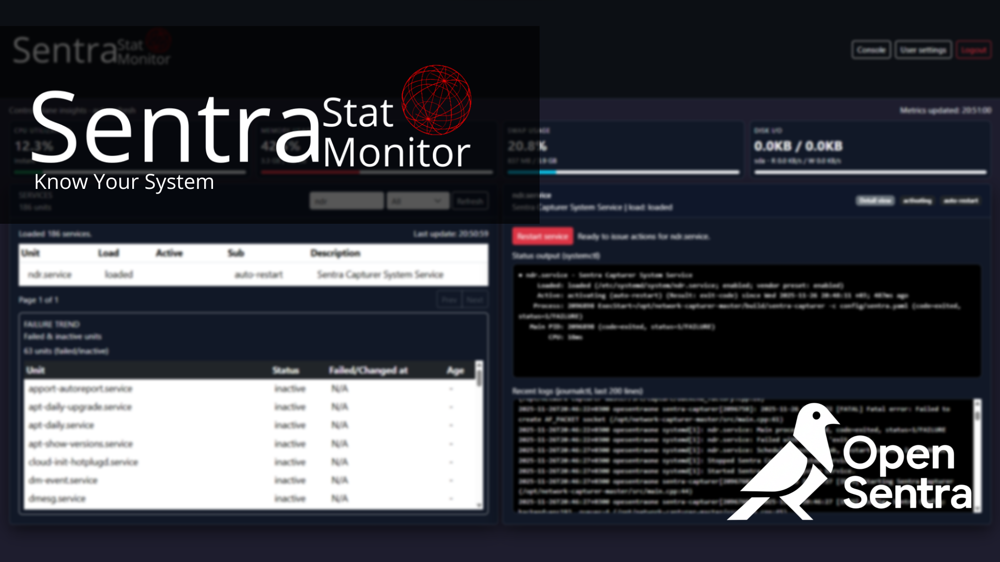

# Sentra Stat Monitor

Linux üzerindeki systemd servislerini, durumlarını ve loglarını takip etmek için hazırlanmış küçük bir dashboard.

Özellikler:
- Tüm systemd servislerini listeleme (filter + pagination)
- Servis durumunu ve son loglarını görüntüleme
- Servisleri yeniden başlatma
- Failed + inactive servisler için failure trend paneli
- Session tabanlı login (MySQL kullanıcı tablosu)
- Kullanıcı şifresini değiştirebilmek için “User settings” sayfası

> Not: Proje demo amaçlıdır. Gerçek bir üretim ortamına almadan önce güvenlik ayarlarını gözden geçirmeniz gerekir.

## Gereksinimler

- Node.js 18+ (senin ortamında 22 çalışıyor)
- npm
- MySQL 8 (veya uyumlu bir MySQL sunucusu)
- Linux (systemd komutları için)

## Kurulum

Depoyu aldıktan sonra:

```bash
npm install
```

Bu komut `express`, `mysql2`, `express-session`, `bcryptjs`, `dotenv` gibi bağımlılıkları yükler.

## Veritabanı Kurulumu

1. MySQL içinde `schema.sql` dosyasını çalıştır:

```bash
mysql -u root -p < schema.sql
```

Bu dosya şunları yapar:

- `sentra_monitor` adında ana veritabanını oluşturur.
- `sentra_monitor_test` adında test veritabanını oluşturur.
- Her iki veritabanında da şu şemaya sahip `users` tablosunu oluşturur:
  - `id` INT UNSIGNED AUTO_INCREMENT PRIMARY KEY
  - `username` VARCHAR(64) UNIQUE
  - `password_hash` VARCHAR(255) (bcrypt hash)
  - `created_at` TIMESTAMP (varsayılan CURRENT_TIMESTAMP)
- Geliştirme için bir tane `admin` kullanıcısı ekler:
  - username: `admin`
  - password (plain): `k+@F1U[bkwA=TD9`

Hash, `bcrypt` ile üretilmiş olup `server.js` tarafından direkt kullanılabilir.

## Ortam Değişkenleri (.env)

Kök dizinde bir `.env` dosyası oluştur ve kendi veritabanın ile eşleştir:

```env
# Server
PORT=4001
SESSION_SECRET=change-this-secret-for-production

# MySQL
DB_HOST=localhost
DB_USER=sentrauser
DB_PASSWORD=your_mysql_password
DB_NAME=sentra_monitor
```

Örnek bir test ortamı için `.testenv` de mevcut, ancak çalışma zamanı sadece `.env` okunur:

```bash
require("dotenv").config();
```

`SESSION_SECRET` değerini üretim ortamında güçlü ve tahmin edilemez bir değerle değiştir.

## Uygulamayı Çalıştırma

```bash
node server.js
```

Sunucu varsayılan olarak şu adreste çalışır:

- `http://localhost:4001`

### Login Akışı

- `GET /login` → Login sayfası (`public/login.html`)
- `POST /login` → MySQL içindeki `users` tablosuna göre kullanıcıyı doğrular.
  - `req.body.username`
  - `req.body.password`
  - `bcrypt.compare` ile hash karşılaştırması
  - Başarılı olursa `req.session.userId` doldurulur ve frontend `/`’e yönlendirir.
- `POST /logout` → Session’ı sonlandırır.

### Sayfalar

- `/login`  
  Logo + basit login formu. Login sonrası `/`’e yönlendirir.

- `/` (dashboard)  
  Sadece login olmuş kullanıcılar erişebilir. Aksi halde `/login`’e redirect edilir.
  - Üst navbar:
    - Sol: logo (156px yükseklik)
    - Sağ: `User settings` ve `Logout` butonları
  - Üstte metrik kartları (CPU, Memory, Swap, Disk I/O)
  - Sol panel: Failure trend + services list (filter + pagination)
  - Sağ panel: Seçili servis için status output + recent logs + restart butonu

- `/user-settings`  
  Şifre değiştirme sayfası (login zorunlu).
  - `POST /api/user/change-password` endpoint’ini kullanır.
  - Alanlar: current password, new password, confirm new password
  - Yeni şifre minimum 8 karakter, `bcrypt` ile hash’lenip DB’de güncellenir.
  - Navbar’da `Back to dashboard` ve `Logout` bulunur.

## PM2 ile Çalıştırma

Uygulamayı PM2 ile servis gibi çalıştırmak istersen:

```bash
cd /path/to/linux-service-dashboard
pm2 start server.js --name sentra-stat-monitor
```

Yararlı komutlar:

```bash
pm2 logs sentra-stat-monitor        # logları izle
pm2 restart sentra-stat-monitor     # süreci yeniden başlat
pm2 stop sentra-stat-monitor        # süreci durdur
pm2 save                            # reboot sonrası otomatik başlatma için süreç listesini kaydet
```

## API Özet

Bütün API endpoint’leri oturum gerektirir (`requireAuth`):

- `GET /api/services`  
  Tüm systemd servislerini listeler.

- `GET /api/services/:name`  
  Belirli bir servis için:
  - `systemctl status <name>`
  - `journalctl -u <name> -n 200`
  çıktılarını JSON olarak döner.

- `GET /api/failed-services`  
  `active === "failed"` olan servisleri ve `systemctl show` üzerinden çekilen durum zamanlarını döner.

- `POST /api/services/:name/restart`  
  Servisi `systemctl restart` ile yeniden başlatır.

- `GET /api/metrics`  
  CPU, bellek, swap ve disk I/O metriklerini (Linux `/proc` üzerinden) döner.

- `POST /api/user/change-password`  
  Oturum açmış kullanıcının şifresini değiştirir.

## Güvenlik Notları

- Şifreler asla plain-text saklanmaz, `bcrypt` ile hash’lenir.
- Service name parametresi regex ile filtrelenir: sadece `a-zA-Z0-9_.@-` + `.service` şeklinde isimlere izin verilir.
- Tüm dashboard ve API endpoint’leri, login sonrası session’a bağlıdır (`requireAuth`).
- Üretim ortamında:
  - `SESSION_SECRET` mutlaka güçlü bir secret olmalı.
  - `.env` ve `.testenv` dosyalarını VCS dışına tut (repo’da `.gitignore` ile hariç bırakılıyor).
  - Gerekirse `cors()` yapılandırmasını sadece gerekli origin’lerle sınırlayabilirsin.

## Geliştirme Notları

- Frontend tarafı sadece statik HTML + Bootstrap + vanilla JS kullanır, derleme adımı yoktur.
- Değişiklik yaptıktan sonra sadece `server.js`’i yeniden başlatman yeterlidir.
